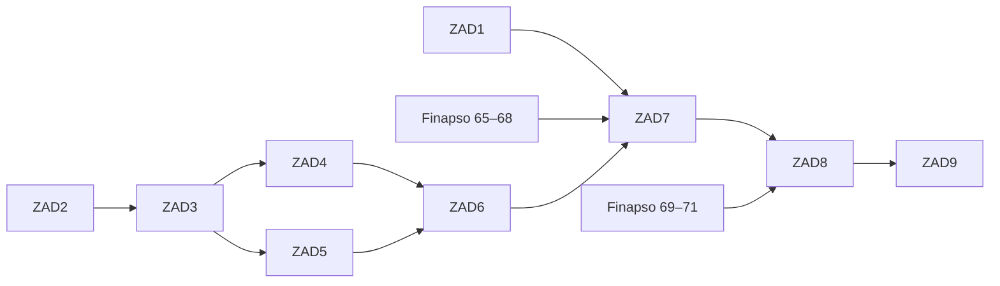

# Plan publicznej strony Finapso

Status: `PLANNED`

Ostatnia aktualizacja: 2026-08-22

## Cel

Zbudować nowoczesny, szybki i dostępny serwis Finapso, który:

- prezentuje aplikację bez obietnic wykraczających poza jej faktyczne działanie;
- udostępnia uporządkowaną dokumentację użytkową;
- pełni rolę publicznego centrum prawnego;
- zapewnia stabilny adres HTML polityki prywatności dla Google Play Console;
- zachowuje możliwość późniejszego przygotowania `app-ads.txt`, jeżeli reklamy
  wrócą do zakresu po osobnej decyzji organizacyjno-prawnej;
- działa bez konta, logowania, analityki, reklam, trackerów, zewnętrznych fontów
  i obowiązkowego JavaScriptu.

Strona będzie serwisem wielostronicowym generowanym statycznie w Astro, a nie
SPA. Każda ważna treść otrzyma własny adres URL i będzie czytelna po bezpośrednim
wejściu oraz po wyłączeniu JavaScriptu.

## Kontekst produktu

Finapso jest aplikacją Android do prywatnego zarządzania finansami osobistymi.
Jej rdzeń działa lokalnie, bez kont użytkowników, bankowego backendu i integracji
bankowej. Strona może przedstawiać budżety, transakcje, analizy, paragony, OCR,
kopie, PIN oraz opcjonalnego asystenta powiadomień, ale opis musi odpowiadać
wersji aplikacji faktycznie dystrybuowanej w Google Play.

Źródłem prawdy pozostaje repozytorium aplikacji, zwłaszcza `README.md`, `UI.md`,
`ADVERTISING.md` i wyniki zadań prywatności 65–72. Istniejące pliki
`Finapso_polityka_prywatności_v.1.0.txt` oraz
`Finapso_regulamin_v.1.0.txt` są materiałami wejściowymi do przeglądu, a nie
automatycznie zatwierdzoną treścią produkcyjną.

## Decyzje architektoniczne

- Generator: Astro z `output: static`.
- Hosting: projektowa witryna GitHub Pages pod adresem
  `https://bartmannn.github.io/finapso-legal/`.
- Konfiguracja Astro: origin `https://bartmannn.github.io`, baza
  `/finapso-legal/` i linki odporne na późniejsze podpięcie domeny własnej.
- Własna domena: opcjonalne przyszłe ulepszenie, a nie warunek budowy szablonu.
- Treść: typowane Markdown/MDX kompilowane do HTML.
- Routing: prawdziwe ścieżki z końcowym ukośnikiem, bez hash routingu.
- JavaScript: zero na stronach prawnych; na pozostałych tylko z działającym
  fallbackiem bez JS.
- Język MVP: polski; późniejsze tłumaczenia pod osobnymi ścieżkami, np. `/en/`.
- Fonty i zasoby: lokalne albo systemowe.
- Prywatność strony: bez analityki, cookies marketingowych, reklam i formularzy
  sieciowych.
- Kontakt: publiczny alias e-mail lub `mailto:`; formularz wymagałby osobnego
  planu przetwarzania i retencji.
- Design: spokojne rozszerzenie interfejsu aplikacji, z jasnym i ciemnym motywem.

Paleta wyjściowa pochodzi z aplikacji: marka `#1F6A49`, delikatna zieleń
`#E7F0EB`, tekst `#1D2420`, tło `#F4F6F4`, karty `#FFFFFF`; ciemny wariant używa
między innymi `#8DBBA4`, `#121613` i `#181D1A`.

## Architektura informacji

| Adres | Rola |
| --- | --- |
| `/` | prezentacja Finapso i wejście do dokumentacji |
| `/features/` | rzetelny opis funkcji |
| `/docs/` | indeks dokumentacji |
| `/docs/getting-started/` | pierwsze kroki |
| `/docs/data-and-backups/` | dane lokalne, eksport i import |
| `/docs/receipts/` | paragony, OCR i korekta |
| `/docs/notifications/` | asystent powiadomień |
| `/privacy/` | bieżąca polityka prywatności HTML |
| `/privacy/archive/` | wcześniejsze zatwierdzone rewizje |
| `/terms/` | warunki korzystania |
| `/support/` | wsparcie, prywatność i żądania dotyczące danych |
| `/licenses/` | informacje o licencjach |
| `/.well-known/security.txt` | kontakt bezpieczeństwa po potwierdzeniu aliasu |
| root hosta: `/app-ads.txt` | prawdziwy wpis AdMob; wymaga osobnego rozwiązania opisanego niżej |
| `/robots.txt`, `/sitemap.xml`, `/404.html` | obsługa crawlerów i błędów |

Polityka ma jeden stabilny adres kanoniczny. Nie używamy skracaczy, parametrów
sesyjnych ani tras typu `#/privacy`. Dokumentacja nie duplikuje polityki, tylko
prowadzi do jej bieżącej wersji.

Bieżący pełny adres polityki po jej utworzeniu to
`https://bartmannn.github.io/finapso-legal/privacy/`. Linki wewnętrzne i zasoby
nie mogą zakładać, że serwis znajduje się w korzeniu hosta.

## Statusy zadań

- `PLANNED` — zadanie ma wystarczający zakres, ale nie zostało rozpoczęte.
- `IN_PROGRESS` — implementacja trwa.
- `BLOCKED` — istnieje konkretny bloker, którego nie można usunąć w ramach
  zadania.
- `COMPLETED` — wszystkie kryteria odbioru i testy zostały spełnione.

## Profil wykonawczy zadań

Każde ZAD jest samodzielnym kontraktem dla pojedynczego modelu GPT-5.6 Terra z
poziomem rozumowania `high`. Wspólne zasady znajdują się w [AGENTS.md](AGENTS.md),
a plik zadania doprecyzowuje:

- rezultat użytkowy i stan wejściowy;
- obowiązkowy kontekst do przeczytania;
- granice autonomii oraz sytuacje wymagające pytania;
- kolejność implementacji i przewidywane pliki;
- kryteria odbioru, testy i kontrolowane przypadki negatywne;
- format raportu oraz gotowy prompt uruchomieniowy.

Instrukcje wspólne są zapisane raz, aby nie tworzyć sprzecznych albo
powtarzających się poleceń. Zadania opisują wynik, ograniczenia i dowody
ukończenia, pozostawiając modelowi wybór najprostszego poprawnego rozwiązania.

## Rejestr podzadań

| ID | Zadanie | Status | Zależności | Plan |
| --- | --- | --- | --- | --- |
| ZAD1 | Decyzje właściciela i kontrakt treści | `COMPLETED` | — | [ZAD1](docs/tasks/ZAD1-decisions-and-content-contract.md) |
| ZAD2 | Fundament statycznego serwisu | `COMPLETED` | — | [ZAD2](docs/tasks/ZAD2-static-site-foundation.md) |
| ZAD3 | Design system i wspólne layouty | `PLANNED` | ZAD2 | [ZAD3](docs/tasks/ZAD3-design-system-and-layouts.md) |
| ZAD4 | Strony produktowe i dokumentacja | `PLANNED` | ZAD3 | [ZAD4](docs/tasks/ZAD4-product-pages-and-documentation.md) |
| ZAD5 | Szablon publicznego centrum prawnego | `PLANNED` | ZAD3 | [ZAD5](docs/tasks/ZAD5-legal-center-template.md) |
| ZAD6 | Bramki jakości i bezpieczeństwa publikacji | `PLANNED` | ZAD4, ZAD5 | [ZAD6](docs/tasks/ZAD6-quality-gates-and-release-safety.md) |
| ZAD7 | Finalna treść prawna i synchronizacja z aplikacją | `PLANNED` | ZAD1, ZAD5, ZAD6, Finapso 65–68 | [ZAD7](docs/tasks/ZAD7-final-legal-content-and-app-sync.md) |
| ZAD8 | Domena, publikacja, Google Play i app-ads.txt | `PLANNED` | ZAD6, ZAD7, Finapso 69–71 | [ZAD8](docs/tasks/ZAD8-domain-play-and-admob-publication.md) |
| ZAD9 | Utrzymanie, monitoring i plan odtworzenia | `PLANNED` | ZAD8 | [ZAD9](docs/tasks/ZAD9-operations-maintenance-and-recovery.md) |

## Kolejność

ZAD1 i ZAD2 mogą rozpocząć się równolegle. Po ukończeniu ZAD3 również ZAD4 i
ZAD5 mogą być realizowane równolegle. Szablon może powstać przed audytem aplikacji, ale
finalna treść prawna w ZAD7 musi poczekać na wyniki zadań 65–68.

## Ochrona wersji demonstracyjnej

Na etapie szablonu `/privacy/` i `/terms/` mogą zawierać lorem ipsum wyłącznie z
widocznym komunikatem:

> Wersja demonstracyjna — treść przykładowa, nie stanowi dokumentu prawnego i
> nie może zostać użyta w Google Play Console.

Szkic otrzymuje `DRAFT` oraz `noindex, nofollow`. Linku do niego nie wolno
wpisywać w Play Console. Build produkcyjny ma odrzucać `lorem ipsum`, `DRAFT`,
przykładową domenę, fikcyjne dane wydawcy, przykładowy kontakt i przykładowy
Publisher ID.

## Globalne wymagania jakościowe

- WCAG 2.2 AA, semantyczny HTML, pełna klawiatura i widoczny fokus.
- Responsywność od 320 px, brak poziomego przewijania i czytelność przy 200%
  powiększeniu.
- Obszary interakcji minimum 44×44 CSS px.
- `prefers-color-scheme` i `prefers-reduced-motion`.
- Drukowalna polityka oraz warunki bez nawigacji i dekoracyjnych elementów.
- Brak JavaScriptu na stronach prawnych.
- Lighthouse docelowo co najmniej 95 w czterech głównych kategoriach.
- LCP poniżej 2,5 s, CLS poniżej 0,1 i kontrolowany budżet zasobów.
- Zanonimizowane zrzuty wyłącznie z danych demonstracyjnych.
- Automatyczna walidacja HTML, linków, dostępności, routingu i placeholderów.
- Minimalne uprawnienia workflow oraz kontrolowane wersje zależności i akcji.

## Bramka Google Play

Adres `/privacy/` wolno podpiąć w Play Console dopiero, gdy:

- zwraca `HTTP 200` i `Content-Type: text/html`;
- jest aktywny, publiczny, nieedytowalny, bez logowania i geoblokady;
- nie jest PDF-em ani plikiem wymuszającym pobranie;
- pełna treść działa w standardowej przeglądarce bez JavaScriptu;
- tytuł jednoznacznie nazywa dokument polityką prywatności;
- dokument wymienia Finapso i podmiot zgodny z listingiem Google Play;
- zawiera kontakt, rodzaje danych, cele, odbiorców, zabezpieczenia, retencję i
  zasady usuwania;
- opisuje faktyczne zachowanie aplikacji i wszystkich SDK;
- ta sama rewizja lub link są dostępne wewnątrz aplikacji;
- treść jest zgodna z Data safety, deklaracjami Play i produkcyjnym AAB;
- nie pozostały placeholdery, fikcyjne dane ani nierozstrzygnięte decyzje.

Sama polityka nie zastępuje prominent disclosure i świadomej zgody w aplikacji,
jeżeli dostęp do danych może być dla użytkownika nieoczekiwany. Finapso obecnie
nie tworzy kont, dlatego wymóg zewnętrznego usunięcia konta nie ma zastosowania.
Jeżeli konta pojawią się w przyszłości, osobna ścieżka usunięcia konta i danych
musi powstać przed wydaniem tej funkcji.

## app-ads.txt

Decyzja MVP z 2026-08-22: pierwsze wydanie aplikacji nie zawiera reklam.
`app-ads.txt`, AdMob, własna domena dla reklam i powiązane deklaracje są
odroczone i nie blokują minimalnej strony ani testów Google Play. Poniższe
wymagania zachowujemy jako materiał na moment świadomego wznowienia monetyzacji.

- Plik pojawia się dopiero po otrzymaniu prawdziwego wpisu z konta AdMob.
- AdMob używa hosta z adresu witryny dewelopera i szuka pliku w jego korzeniu.
  Dla bieżącej strony oznacza to `https://bartmannn.github.io/app-ads.txt`, a nie
  `https://bartmannn.github.io/finapso-legal/app-ads.txt`.
- Repozytorium projektowe `finapso-legal` nie może samodzielnie opublikować
  pliku w korzeniu `bartmannn.github.io`. Przed reklamami trzeba wybrać jedno z
  rozwiązań:
  - utrzymywać root user site w repozytorium `Bartmannn/Bartmannn.github.io` i
    publikować tam `app-ads.txt`;
  - podpiąć własną domenę pozwalającą kontrolować jej katalog główny;
  - użyć innego oficjalnie wspieranego hostingu i odpowiednio ustawić witrynę
    dewelopera.
- Musi zwracać `HTTP 200`, poprawny tekst UTF-8 i być dostępny dla crawlera.
- HTTP ma poprawnie prowadzić do HTTPS, a `robots.txt` nie może blokować
  `Google-adstxt`, `Mediapartners-Google` ani Googlebota.
- Przykładowy, pusty lub wymyślony Publisher ID nie spełnia zadania.

## Dodatkowe obszary, o które dbamy

Podział na zadania rozszerza pierwotny plan o elementy często pomijane przy
małych stronach aplikacji:

- archiwum zatwierdzonych rewizji polityki przy zachowaniu jednego bieżącego
  adresu;
- `/.well-known/security.txt` i publiczny proces zgłaszania podatności;
- drukowalność dokumentów prawnych;
- kontrolę braku zewnętrznych żądań i trackerów;
- dwa tryby builda: bezpieczny podgląd szkicu i restrykcyjna produkcja;
- macierz zgodności strony, UI aplikacji, Data safety i Play Console;
- plan odtworzenia domeny, DNS i GitHub Pages po awarii;
- monitoring dostępności bez dodawania skryptów śledzących;
- właściciela odnowienia domeny, kontaktów i okresowego przeglądu treści;
- strukturalne dane, canonical, sitemap i metadane społecznościowe;
- gotowość do tłumaczeń bez geoblokady i automatycznych przekierowań;
- jawne rozdzielenie usuwania danych lokalnych, danych wsparcia i ewentualnych
  przyszłych kont.

Nie dodajemy teraz PWA, wyszukiwarki, chatbotów, osadzonych filmów, publicznego
formularza ani analityki. Każdy z tych elementów zwiększa złożoność, powierzchnię
prywatności lub utrzymania i wymaga osobnej, uzasadnionej decyzji.

## Definicja ukończenia całego planu

- Wszystkie ZAD1–ZAD9 mają status `COMPLETED`.
- Wszystkie trasy istnieją jako osobne, dostępne strony HTML.
- Hosting GitHub Pages i HTTPS są zweryfikowane, monitorowane i mają plan
  odtworzenia.
- Polityka oraz warunki zostały zatwierdzone i nie zawierają placeholderów.
- Strona, aplikacja, listing, Data safety i konfiguracja reklam są spójne.
- Pierwsze wydanie nie zawiera reklam; `app-ads.txt` nie jest jego wymaganiem.
- Testy funkcjonalne, dostępności, wydajności, linków i crawlability przechodzą.
- Istnieje odpowiedzialność operacyjna za domenę, wsparcie i kolejne rewizje.

## Zasady realizacji podzadań

1. Przed rozpoczęciem sprawdź status i zależności w tym rejestrze.
2. Ustaw zadanie na `IN_PROGRESS` w tabeli oraz jego pliku.
3. Nie rozpoczynaj ZAD7 na podstawie lorem ipsum lub nieukończonego audytu.
4. Nie zapisuj sekretów, prywatnych danych właściciela, Publisher ID ani danych
   użytkowników w Git lub promptach.
5. Nie zmieniaj aplikacji Android w ramach zadania strony bez osobnego zakresu
   zgodnego z planami repozytorium aplikacji.
6. Po wykonaniu uruchom wszystkie testy wskazane w zadaniu i `git diff --check`.
7. Dopiero wtedy ustaw `COMPLETED`, zapisz wynik odbioru, wykonaj jawny
   `git add -- <ścieżki>` i lokalny `git commit` zgodnie z `AGENTS.md`.
8. W raporcie podaj hash commitu i status repozytorium; nigdy nie wykonuj `push`.
9. Wymagania Google, SDK i zależności sprawdź ponownie przed publikacją.

## Oficjalne źródła

Stan sprawdzony przy utworzeniu planu: 2026-08-21.

- [Google Play — User Data](https://support.google.com/googleplay/android-developer/answer/10144311?hl=en)
- [Google Play — Data safety](https://support.google.com/googleplay/android-developer/answer/10787469?hl=en)
- [Google Play — Financial features declaration](https://support.google.com/googleplay/android-developer/answer/13849271?hl=en)
- [Google AdMob — konfiguracja app-ads.txt](https://support.google.com/admob/answer/9363762?hl=en)
- [Google AdMob — dostępność app-ads.txt dla crawlera](https://support.google.com/admob/answer/9679128?hl=en)
- [GitHub Pages — własna domena](https://docs.github.com/en/pages/configuring-a-custom-domain-for-your-github-pages-site/managing-a-custom-domain-for-your-github-pages-site)
- [GitHub Pages — HTTPS](https://docs.github.com/en/pages/getting-started-with-github-pages/securing-your-github-pages-site-with-https)
- [OpenAI — GPT-5.6 Terra](https://developers.openai.com/api/docs/models/gpt-5.6-terra)
- [OpenAI — wskazówki promptowania GPT-5.6](https://developers.openai.com/api/docs/guides/prompt-guidance-gpt-5p6)

Ten plan nie zastępuje porady prawnej. Wymagania należy zweryfikować ponownie
bezpośrednio przed publicznym wydaniem.
